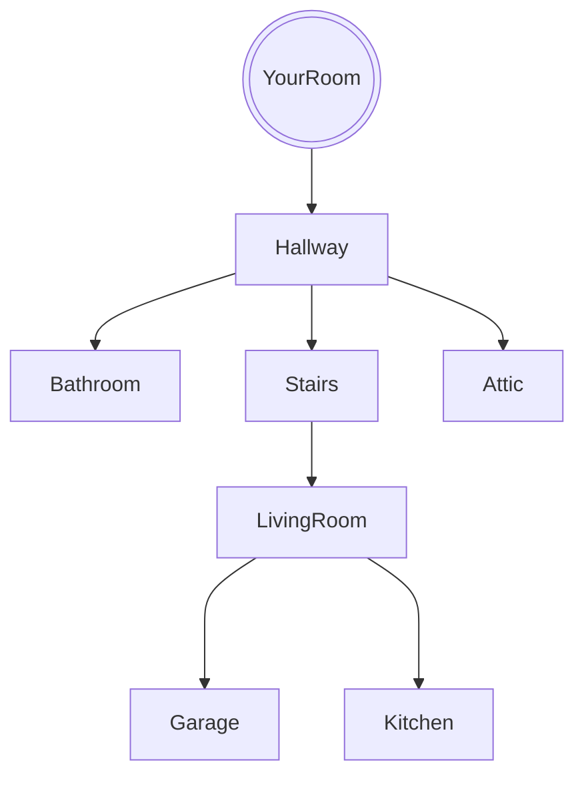

# Find The Cheese

## Setting

The game takes place in the player's house. 

## Map

The player starts in their room.

## Story

Your pet mouse is hungry.
find the cheese and give it to your mouse
## Global Variables

my global variables  are
`haveCheese`,`haveLadder`, and `haveKey`

each of these are important because you will need to have these items in order
to continue the story.

